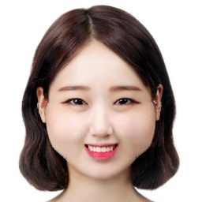
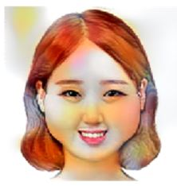
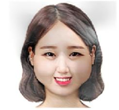

# Caricature-with-Style_transfer
Distort face image and perform style transfer to make caricature

# Sample image
I use Korean Celeb face image. (http://www.wikitree.co.kr/main/news_view.php?id=288591)

> Before & After of distortion  

> After discretization of HSV representation of face image. (oil painting method)  

> After Style transger  

